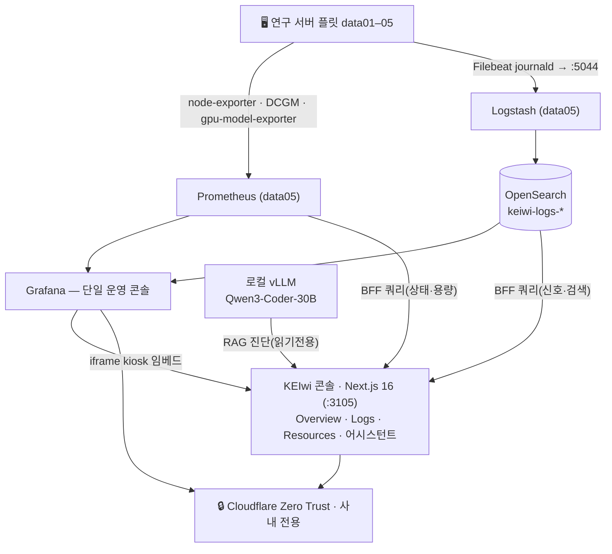
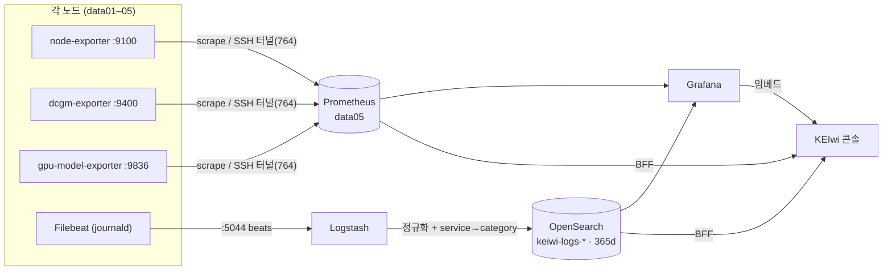
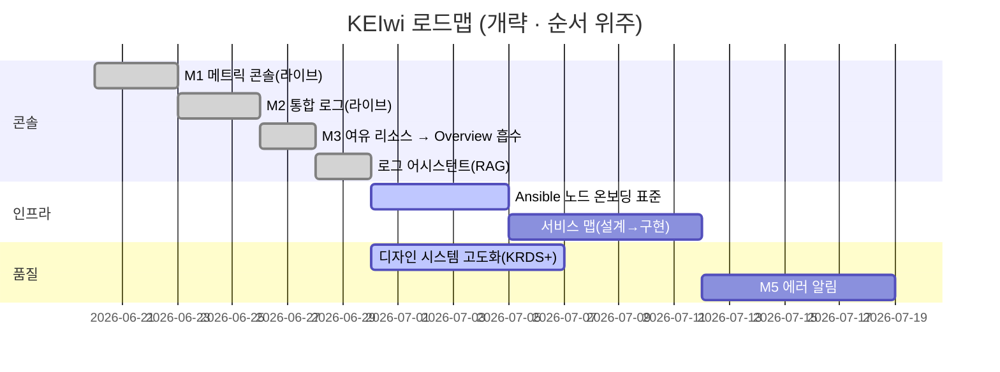

# KEIwi · 온프레미스 플릿 관제 콘솔

> **KEIwi**("키위")는 KEI 연구 서버 플릿(`data01~05`)을 **하나의 콘솔에서 모니터링·로깅·진단**하고, *어느 서버가 여유 있는지*를 판단해 GPU 작업 배치를 돕는 **온프레미스 관제 시스템**입니다.
>
> 단일 운영 콘솔은 **Grafana**이고, KEIwi 콘솔(**Next.js 16**)은 그 위에 얹힌 **브랜드 front door** — Grafana를 iframe으로 임베드하고, 플릿 상태·여유 리소스·로그 어시스턴트 같은 **커스텀 뷰만** 더합니다(대시보드를 재구현하지 않습니다). 메트릭은 **Prometheus**(node-exporter·DCGM·gpu-model-exporter), 로그는 **Filebeat → Logstash → OpenSearch**로 모으고, 로그 어시스턴트는 **사내 GPU의 로컬 vLLM**으로 답합니다(외부 전송 0). 모든 화면은 **Cloudflare Zero Trust** 뒤(사내 전용)에 둡니다.

| 항목 | 상태 |
| --- | --- |
| 상태 | 🟢 **M1 메트릭 · M2 로그 라이브** — 콘솔(Overview·Logs·Resources·어시스턴트) 가동, 플릿 상태/용량 판정/로그 신호·RAG 진단 검증 완료 |
| 플릿 | 🖥️ 5노드 `data01~05`(`192.168.1.101~105`) · control=`data05` · GPU: data04 Quadro RTX 6000×2 · data05 A40×2 |
| 메트릭 | Prometheus + node-exporter(:9100) · DCGM(:9400) · **gpu-model-exporter(:9836, 모델↔GPU)** |
| 로그 | Filebeat(journald) → Logstash(:5044) → **OpenSearch `keiwi-logs-*`**(365d 보존) → Grafana |
| 어시스턴트 | 🤖 로컬 vLLM(Qwen3-Coder-30B) + BM25 RAG · **읽기 전용 · egress 0 · 서버검증 인용** |
| 디자인 | KRDS 토큰(Pretendard GOV · 라이트/다크) · Tailwind v4 |
| 배포 | 🔒 사내 전용(Cloudflare Zero Trust) · 에이전트=Ansible role · **적용은 사람**(헌장 §11) |
| 조직 / 레포 | KEI · 한국환경연구원 · github.com/mooner92/KEIwi |

> [!IMPORTANT]
> 모든 작업의 진입점은 [`Constitution.md`](./Constitution.md)(프로젝트 헌장 · 최우선 권위)와 [`AGENTS.md`](./AGENTS.md)(목차)입니다. **먼저 이 둘을 읽으세요.** 플릿 구성의 단일 기준은 [`docs/inventory.yaml`](./docs/inventory.yaml)입니다(§0).

---

## 누구를 위한 것

- **운영자 — 플릿 관제:** Overview에서 5노드 상태와 *여유 GPU*를 한눈에 보고, 로그 신호가 뜨면 **어시스턴트로 근거와 함께 진단**합니다. 깊은 탐색은 임베드된 **Grafana**로 위임합니다.
- **개발자 / 에이전트 — SDD로 기여:** 이 README → [`AGENTS.md`](./AGENTS.md) → `specs/`·`docs/decisions/`로 들어갑니다. 행동을 바꾸려면 **spec을 먼저** 고치고, 기술 선택은 **ADR**로 근거를 남깁니다.

> [!NOTE]
> 어시스턴트의 답은 **출발점**입니다 — 항상 서버가 검증한 **근거 로그 번호**(`[1] [2]…`)를 함께 보여주고, 조치는 **자동 적용하지 않습니다**(읽기 전용).

---

## 핵심 개념 — 단일 콘솔, 두 데이터 평면

운영 콘솔은 **Grafana 하나**입니다. 같은 플릿을 두 평면(**메트릭** · **로그**)으로 모으고, KEIwi 콘솔이 그 위에 *플릿 요약·여유 판정·로그 어시스턴트* 같은 커스텀 뷰를 얹습니다.



핵심: **콘솔은 Grafana를 대체하지 않습니다.** 표준 대시보드는 임베드하고(§I-2), 콘솔은 *플릿 상태·여유 GPU 판정·로그 신호→어시스턴트 진단*처럼 Grafana가 잘 못 하는 것만 네이티브로 제공합니다.

---

## 빠른 시작 (Quickstart)

> [!WARNING] 전제
> - 콘솔 빌드·실행에 **Node v22+**. 개발/검증은 `data05`에서 하되 **라이브 관제 스택을 방해하지 않습니다**(§12 — 격리 포트·별도 빌드).
> - 메트릭/로그 스택(Prometheus·Grafana·OpenSearch·Logstash)은 `data05`에 가동 중이어야 합니다. 콘솔은 `OPENSEARCH_URL`·`VLLM_URL`·`GRAFANA_URL` 등을 `.env.local`에서 읽습니다(시크릿은 레포 밖 §13).

```bash
git clone https://github.com/mooner92/KEIwi.git
cd KEIwi/apps/console
cp .env.example .env.local      # 사용자가 값을 채운다(§13)
npm install
npm run dev                     # http://localhost:3105

# 검증(빌드는 라이브 .next를 건드리므로 사람이 별도로):
npm run typecheck && npm run lint && npm run test && npm run check:no-raw-hex
```

> [!NOTE] 노드 추가/삭제
> 새 서버를 관리망에 붙이거나 뺄 때는 **단일 표준 절차**를 따릅니다 → [`docs/runbooks/node-onboarding.md`](./docs/runbooks/node-onboarding.md)(메트릭·로그 두 평면 · Ansible role · §11). 결정 근거 [ADR-0017](./docs/decisions/0017-node-onboarding-standard.md).

---

## 레포 구조

```text
KEIwi/
├─ Constitution.md        # ⚖️ 프로젝트 헌장 — 최우선 권위(불변 규칙)
├─ AGENTS.md              # 🗺️ 목차/지도 — 여기서 시작
├─ README.md              # ← 이 문서
├─ docs/
│  ├─ inventory.yaml      #   📍 플릿 단일 기준(SoT, §0) — 노드·exporters
│  ├─ decisions/          #   📑 ADR 0001–0017 (기술·의존성 선택 근거)
│  ├─ runbooks/           #   🛠️ 운영 런북 (node-onboarding · rsyslog-flood)
│  ├─ prompts/            #   ✍️ 마일스톤 빌드 프롬프트
│  └─ testing.md          #   ✅ 시각 QA(Playwright) 절차
├─ design-system/         # 🎨 KRDS 토큰·스펙(principles·color·shape·layout·typography)
├─ specs/                 # 📋 SDD — M1-console · M2-logs · M3-resources · assistant · service-map · krds-redesign
├─ infra/
│  ├─ monitoring/         #   📈 Prometheus·Grafana 프로비저닝·대시보드·gpu-model-exporter·SSH 터널
│  ├─ logging/            #   📜 OpenSearch+Logstash compose·파이프라인·Filebeat 표준
│  └─ ansible/            #   🤖 에이전트 배포 role(filebeat · gpu-model-exporter) + 인벤토리
└─ apps/
   └─ console/            # 🖥️ KEIwi 콘솔 (Next.js 16 · KRDS) — Overview/Logs/Resources/어시스턴트
```

> [!TIP]
> 콘솔은 `apps/console/.next`에서 **라이브로 서빙**됩니다 — 에이전트가 같은 디렉터리를 편집하므로, 빌드/배포(`npm run build && systemctl restart keiwi-console`)는 **사람이** 수행합니다(§11·§12).

---

## 데이터 흐름 (수집 파이프라인)



- **메트릭:** Prometheus가 각 노드의 exporter를 scrape(직접 도달 불가한 노드는 `data05`의 SSH 터널 경유). `instance` 라벨을 inventory와 정확히 일치시켜 콘솔이 up/down/no-data를 매칭합니다.
- **로그:** Filebeat(journald) → Logstash가 `fleet_node`/`service`/`log_level` 정규화 + `service→category` 분류([ADR-0010](./docs/decisions/0010-log-taxonomy.md)) → OpenSearch `keiwi-logs-*`(ISM 365d 보존) → Grafana(신호 우선 대시보드, [ADR-0011](./docs/decisions/0011-signal-first-log-ux.md)).
- **어시스턴트:** 신호(또는 자유 질의)를 OpenSearch에서 검색 → 번호 근거로 프롬프트 구성 → **로컬 vLLM**이 인용과 함께 진단([ADR-0014](./docs/decisions/0014-log-assistant.md)·[0015](./docs/decisions/0015-assistant-exploratory-query.md)).

---

## 문서 지도

전체 문서 인덱스 허브: **[docs/README.md](./docs/README.md)**.

> [!TIP] 독자별 추천 경로
> - **운영자:** README → `docs/runbooks/` → Grafana 콘솔
> - **개발자/에이전트:** [AGENTS.md](./AGENTS.md) → 해당 `specs/<name>/` → `docs/decisions/`
> - **디자인:** [`design-system/spec/principles.md`](./design-system/spec/principles.md) → [ADR-0006](./docs/decisions/0006-krds-adoption.md)·[0007](./docs/decisions/0007-brand-color-strategy.md)

| 영역 | 무엇 | 링크 |
| --- | --- | --- |
| 헌장 | 불변 규칙·권위 순서·SDD·안전(§11/§12/§13) | [Constitution.md](./Constitution.md) |
| 목차 | 디렉터리 지도·읽기 순서·ADR 색인 | [AGENTS.md](./AGENTS.md) |
| 플릿 SoT | 노드·exporters 단일 기준 | [docs/inventory.yaml](./docs/inventory.yaml) |
| 스펙(SDD) | M1-console · M2-logs · M3-resources · assistant · service-map | [specs/](./specs) |
| 런북 | 노드 온보딩/오프보딩 · rsyslog 폭주 대응 | [docs/runbooks/](./docs/runbooks) |
| 디자인 시스템 | KRDS 토큰·색·shape·타이포 규약 | [design-system/spec/](./design-system/spec) |
| 시각 QA | Playwright 스크린샷 검증 절차 | [docs/testing.md](./docs/testing.md) |

**아키텍처 결정 기록(ADR) — `docs/decisions/`:**

| # | 결정 | # | 결정 |
| --- | --- | --- | --- |
| 0001 | 프레임워크·스타일링 | 0010 | 로그 분류 체계(category) |
| 0002 | Grafana 임베드(단일 콘솔) | 0011 | 신호 우선 로그 UX |
| 0003 | inventory.yaml 파서 | 0012 | 로드맵 M3→Overview·M4 보류 |
| 0004 | 설정 검증(zod) | 0013 | 용량(여유) 판정 정책 |
| 0005 | 단위 테스트 러너 | 0014 | 로그 어시스턴트 |
| 0006 | KRDS 채택 | 0015 | 어시스턴트 탐색형 질의 |
| 0007 | 브랜드 컬러 전략 | 0016 | GPU 드릴다운 DCGM 분리 |
| 0008 | 로그 파이프라인 | 0017 | **노드 온보딩 표준** |
| 0009 | Ansible 설정관리 | | |

---

## 콘솔 화면

| 경로 | 화면 | 내용 |
| --- | --- | --- |
| `/overview` | **Overview** | 플릿 상태(up/down/no-data) + **여유 GPU 판정**·작업 배치 힌트. 노드 클릭 → **서비스**(네이티브 카탈로그: 서비스·모델·포트 + 로그·진단 링크)·시스템·GPU·모델 드릴다운 |
| `/logs` | **Logs** | 통합 로그(Grafana `keiwi-logs` 대시보드 임베드 · 신호 우선) |
| `/resources` | **Resources** | 용량 상세(M3 → Overview에 흡수, [ADR-0012](./docs/decisions/0012-roadmap-m3-m4-pivot.md)) |
| `/incidents` | **어시스턴트** | 현재 신호(error·warn) → "분석" → 로컬 vLLM RAG 진단(근거 인용·런북 매칭) |

---

## 기술 스택

| 영역 | 선택 | 비고 |
| --- | --- | --- |
| 콘솔 | **Next.js 16** App Router + React 19 + TS | Tailwind v4(`@theme` · KRDS 토큰 · raw hex 금지) · zod(env 검증) · vitest · force-dynamic · 서버 전용 BFF |
| 메트릭 | **Prometheus** | node-exporter(:9100) · DCGM(:9400) · gpu-model-exporter(:9836, 모델↔GPU↔포트). 직접 도달 불가 노드는 SSH 터널(:764) |
| 로그 | **OpenSearch** (ES 7.10 호환) | Filebeat(journald) → Logstash(:5044, `service→category`) → `keiwi-logs-*`(ISM 365d) |
| 대시보드 | **Grafana** | 단일 운영 콘솔 · `grafana-opensearch-datasource` · iframe kiosk 임베드(테마 동기화) |
| 어시스턴트 | **로컬 vLLM** (Qwen3-Coder-30B) | BM25 RAG · 읽기 전용 · 외부 egress 0 · 서버검증 번호 인용 · 인젝션 격리 · GPU 단일 인플라이트 |
| 배포 | **Ansible** (agentless) | role-per-agent(filebeat · gpu-model-exporter) · inventory.yaml SoT · 적용은 사람(§11) |
| 디자인 | **KRDS** 토큰 | Pretendard GOV · 라이트/다크 · `design-system/spec/` |
| 접근 | **Cloudflare Zero Trust** | 사내 전용 · 콘솔/Grafana 모두 Access 뒤 |

---

## ⛔ 절대 규칙 (헌장 요약)

전체는 [`Constitution.md`](./Constitution.md). 어떤 문서·코드에서도 약화시키지 마세요.

1. **단일 콘솔 = Grafana** — 표준 대시보드를 콘솔에 재구현하지 않는다(§I-2). 콘솔이 임베드하는 대시보드는 UI 수제가 아니라 **레포 프로비저닝**이어야 한다([ADR-0016](./docs/decisions/0016-gpu-drilldown-dcgm.md) 교훈).
2. **inventory.yaml = 단일 기준** — 노드·exporters 사실은 여기서 시작(§0).
3. **에이전트 생성 · 사람 적용** — 에이전트는 코드/스펙/런북을 레포에 만들고, 프로덕션 적용·배포·SSH 설치는 **사람**이 한다(§11).
4. **라이브 스택 직접 수정 금지** — 개발은 격리해서, 라이브 관제 스택을 방해하지 않는다(§12).
5. **시크릿은 레포 밖** — 키·비번·토큰은 커밋하지 않는다(§13).
6. **Spec이 진실원천 · 의존성=ADR · 수용기준은 기계검증** (§7·§8·§9).

---

## 보안 / 온프레미스

> [!WARNING]
> KEI 내부 시스템입니다. **콘솔·Grafana 어느 화면도 인터넷에 공개하지 않습니다.**

- 콘솔·Grafana는 **Cloudflare Zero Trust Access** 뒤(또는 사내망 한정). SSH는 비표준 포트(:764).
- 어시스턴트는 **외부 전송 0** — 검색(내부 OpenSearch)·생성(사내 GPU vLLM)이 모두 망 안. 읽기 전용이라 조치를 자동 적용하지 않는다.
- 시크릿(키·비번·`.env.local`)은 **레포 밖**(§13). 인벤토리/Ansible에도 평문 비번 없음(무비번 sudo 또는 `-K` 프롬프트).
- 메트릭·로그·모델이 전부 **온프레미스**라 데이터가 망 밖으로 나가지 않습니다.

---

## 상태 & 다음

> 로드맵 조정([ADR-0012](./docs/decisions/0012-roadmap-m3-m4-pivot.md), 2026-06-28): **M3는 Overview에 흡수, M4는 보류, 다음은 M1/M2 고도화.**

| | 내용 | 상태 |
| --- | --- | --- |
| **M1** | 통합 메트릭 콘솔(시스템·GPU + 모델↔GPU 매핑) | ✅ 라이브 |
| **M2** | 통합 로그(OpenSearch · 분류 · 신호 우선 · 365d) | ✅ 라이브 |
| **M3** | 여유 리소스("free" 판정 + 작업 배치) → **Overview 흡수** | 재배치 |
| **M4** | 장애 추적·시각화 | **보류**(M2 신호뷰로 충족) |
| **M5** | 크리티컬 에러 알림(에러→책임자) | 후순위 |
| **진행** | 로그 어시스턴트 · 노드 온보딩 표준 · 서비스 맵(설계) · 디자인 고도화 | 🔄 |



> [!NOTE]
> 간트는 **순서**를 보여주는 개략도입니다(구체 일정 미정). 진행은 각 `specs/<name>/tasks.md`, 결정은 `docs/decisions/`에서 관리합니다.

---

## 내부 전용 고지

본 저장소와 산출물은 **KEI(한국환경연구원) 내부 전용**입니다. 외부 배포·공개·재사용을 금합니다. 협업은 권한이 부여된 계정에 한합니다.

**진입점:** [Constitution.md](./Constitution.md) · [AGENTS.md](./AGENTS.md) · [docs/inventory.yaml](./docs/inventory.yaml)
