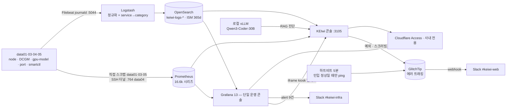

# KEIwi · 온프레미스 플릿 관제 콘솔

KEI 연구 서버 플릿(`data01~05`)을 **하나의 콘솔에서 모니터링·로깅·진단**하는 온프레미스 관제 시스템. 단일 운영 콘솔은 **Grafana**이고, KEIwi 콘솔(Next.js 16)은 그 위에 얹힌 front door로 Grafana를 임베드하고 *플릿 상태·여유 GPU 판정·로그 어시스턴트*만 네이티브로 더한다. 메트릭·로그·모델이 전부 사내에 있고 외부로 나가지 않는다. **KEI 내부 전용 — 외부 공개·배포 금지.**

> [!IMPORTANT]
> 권위 순서는 **[`Constitution.md`](./Constitution.md)(헌장, 최우선) → [`docs/inventory.yaml`](./docs/inventory.yaml)(플릿 SoT, §0) → 작업 중인 `specs/<name>/spec.md`** 이다. 이 README는 **지도**일 뿐 진실원천이 아니다. 에이전트 목차는 [`AGENTS.md`](./AGENTS.md).

**바로 가기** — 운영자: [지금 상태](#지금-상태) · [문제가 생겼을 때](#문제가-생겼을-때--자주-터지는-5가지) · [무엇이 수집되고 무엇이 안 되나](#무엇이-수집되고-무엇이-안-되나) / 개발자·에이전트: [어디서 작업하나](#개발자와-에이전트-시작하기) · [검증 게이트](#검증-게이트) · [문서 지도](#문서-지도)

---

## 지금 상태

**모두 `data05`(관제 스택 호스트)에서 2026-07-31 실측.** 값이 아니라 확인 명령이 계약이다 — 의심되면 직접 돌린다.

| 항목 | 값 | 확인 |
| --- | --- | --- |
| Prometheus 스크랩 타깃 | 21개 중 **20 up** (down 1 = vLLM `:8010` — MineSweeper OCR, disabled·필요 시 수동 기동) | `curl -s 'localhost:9090/api/v1/query?query=sum(up)'` · 분모는 `count(up)` |
| 활성 시계열 | **16,633** | `count({__name__!=""})` |
| recording rules | **24개 / 7그룹** ([`infra/monitoring/rules/`](./infra/monitoring/rules)) | `curl -s localhost:9090/api/v1/rules` |
| **alert 규칙** | **9개 — 전부 `inactive`+`ok`(발화 0)** | `localhost:3000/api/prometheus/grafana/api/v1/rules` |
| 알림 채널 | Slack `#keiwi-infra`(인프라) · `#keiwi-web`(앱 에러) | Grafana contact points 2개 · GlitchTip webhook 1개 |
| DCGM GPU | **6장** — data03·04 Quadro RTX 6000 ×2, data05 A40 ×2 | `count by(instance)(DCGM_FI_DEV_GPU_UTIL)` |
| 로그 인덱스 | **150개**(2026-03-04~) · **32.0M 문서** | `curl -s 'localhost:9200/_cat/indices/keiwi-logs-*'` |
| 로그 인입 | **4노드 실시간**(data01·03·04·05) ≈ **17/초** | `_count` 두 번 찍어 증가 확인 |
| 에러 트래킹 | **GlitchTip 6.2.2** 자체호스팅 · 이벤트 90일 보존 | `curl -s -o /dev/null -w '%{http_code}' 127.0.0.1:8090/_health/` |
| 하트비트 | **5분 주기** dead man's switch 가동 | `systemctl is-active keiwi-log-heartbeat.timer` |
| Grafana | **13.0.1** · 대시보드 **9개**(원본 4 + v3 4 + syshealth) | `localhost:3000/api/search?type=dash-db` |
| 콘솔 단위 테스트 | **88 passed / 7 files** | `cd apps/console && npm run test` |

> [!IMPORTANT] 알림 계층 — 2026-07-31 가동 시작
> 이 시스템에는 오랫동안 **alert 규칙이 0건**이었고, 그 비용이 실제로 측정됐다:
> **2026-07-24~30, 로그 인입이 5.7일간 조용히 멈췄고 아무도 몰랐다**(발견 경로는 알림이 아니라 우연한 조회).
> 원인은 독립 결함 2개 — ① filebeat 7.17이 지원하지 않는 `include_matches: not …`가 이벤트를 조용히
> 전멸시킴 ② `/KEIwi`에서의 `git checkout`이 라이브 Logstash 리로드를 유발.
>
> 지금은 **3중으로 덮는다**:
> | 감시 대상 | 감시 주체 | 채널 |
> | --- | --- | --- |
> | 인프라 지표(노드·디스크·GPU·로그 인입) | Grafana 규칙 9건 | `#keiwi-infra` |
> | 콘솔 앱 예외·성능 | GlitchTip | `#keiwi-web` |
> | **관측 스택 자체의 침묵** | GlitchTip uptime + 하트비트 | `#keiwi-web` |
>
> 하트비트가 핵심이다 — **Grafana가 죽어도 동작**한다. 탐지 시간이 **5.7일 → 약 40분(205배)**로 줄었다.
> 남은 한계: GlitchTip도 data05에 있어 **호스트 전체 장애는 못 잡는다**(크로스노드 watchdog = hardware-ops T4-12).
> 런북 → [`log-ingestion-stopped`](./docs/runbooks/log-ingestion-stopped.md) · 임계 근거 → [`specs/alerting`](./specs/alerting/spec.md) · 에러 트래킹 → [`specs/error-tracking`](./specs/error-tracking/README.md)

---

## 문제가 생겼을 때 — 자주 터지는 5가지

| 증상 | 30초 확인 | 다음 |
| --- | --- | --- |
| **로그가 안 들어온다**(대시보드는 "에러 0건" 초록) | `curl -s 'localhost:9200/keiwi-logs-*/_count'; sleep 20; curl -s 'localhost:9200/keiwi-logs-*/_count'` — 안 늘면 정지 | [log-ingestion-stopped](./docs/runbooks/log-ingestion-stopped.md) §1 판독표 → 전 노드 정지면 수신측(§2), 일부만이면 그 노드 Filebeat(§3) |
| **Grafana 임베드가 비거나 로그인 루프** | `BASE=http://127.0.0.1:3199 node scripts/embed-host-test.mjs` (접속 host 분기 회귀 가드) | 익명 뷰어 403이면 대시보드 개별 권한 → [infra/monitoring](./infra/monitoring/README.md) "Grafana 익명 뷰어" |
| **노드가 no-data** | `sum(up)` 감소 · `localhost:9090/api/v1/targets` 에서 해당 job 확인 | `instance` 라벨이 [`inventory.yaml`](./docs/inventory.yaml)과 정확히 같아야 매칭된다 → [node-onboarding](./docs/runbooks/node-onboarding.md) |
| **GPU 여유가 "판정불가"** | `count by(instance)(gpu_vram_total_bytes)` 에 그 노드가 없음 | gpu-model-exporter 결손 또는 드라이버 mismatch. 직전 사례 data05는 **2026-08-06 재부팅으로 해소** → [nvidia-driver-mismatch](./docs/runbooks/nvidia-driver-mismatch.md) · 판정 규칙 [ADR-0013](./docs/decisions/0013-capacity-judgment-policy.md) |
| **디스크가 급증** | `df -h /data` · `_cat/indices` 로 특정 일자 인덱스 급증 확인 | rsyslog 폭주면 [rsyslog-omfile-flood](./docs/runbooks/rsyslog-omfile-flood.md). 보존은 ISM 365d |
| **Slack 알림이 안 온다** | `journalctl -u keiwi-log-heartbeat -n 5` · Grafana 규칙 health 확인 | ⚠️ 이 망은 **`slack.com`을 SNI 차단**한다(TCP는 열리는데 TLS 리셋). Grafana는 `endpointUrl`로 `api.slack.com` 우회, GlitchTip은 `hooks.slack.com`(원래 열림) 사용 — [specs/alerting](./specs/alerting/spec.md) |
| **알림이 너무 많다** | 2주 발화 집계 → 조치율 낮은 규칙 식별 | 임계는 **자체 30일 분포 p99** 기준으로 정한다. 업계 기본값은 우리 baseline에서 상시 발화한다(실증: 디스크 80%·메모리 10%·GPU 85°C 셋 다) → [specs/alerting §1](./specs/alerting/spec.md) |

---

## 무엇이 수집되고 무엇이 안 되나

| 노드 | 메트릭 | 로그 | 비고 |
| --- | --- | --- | --- |
| **data01** `.101` | node · gpu-model · port (**직접**) | ✅ (2026-07-24~) | Ubuntu 16.04 xenial · Tesla M4 ×1 **드라이버 418 → DCGM 불가**. filebeat는 8.x apt 불가라 **7.17 벤더링**([`filebeat-xenial`](./infra/logging/filebeat-xenial/README.md)) — Ansible `[logging]` 그룹 **밖**(수동 관리) |
| **data02** `.102` | ❌ | ❌ | Windows. `windows_exporter`·winlogbeat role 부재 — 백로그 |
| **data03** `.103` | node · DCGM · gpu-model · port · smartctl (**직접**) | ✅ | Quadro RTX 6000 ×2 (2026-07-03 온보딩) |
| **data04** `.104` | node · DCGM · gpu-model · port (**SSH 터널** `:764`) | ✅ | Quadro RTX 6000 ×2. smartctl은 터널 미배선(포트 충돌 — `prometheus.yml`에 주석으로 대기) |
| **data05** `.105` | node · DCGM · port · smartctl · **glitchtip** | ✅ | A40 ×2 · 관제 스택 호스트 + 개발. smartctl은 ufw 브리지 규칙 추가로 복구(2026-07-31). 드라이버 mismatch는 **2026-08-06 재부팅으로 해소**(595.84 정합 — [런북](./docs/runbooks/nvidia-driver-mismatch.md)) |

**아직 한 건도 수집되지 않는 것:** BMC/iLO(팬·PSU·인렛 온도)·하드웨어 이벤트 로그(SEL)·Windows(data02). 플릿은 HPE ProLiant DL380 4대이고 BMC가 4노드 전부에 있다 — 실측 근거와 도입 설계는 [`specs/hardware-ops/`](./specs/hardware-ops/README.md)(게이트 통과 후 착수).

**수집 중인 것:** node-exporter `:9100` · DCGM `:9400` · gpu-model-exporter `:9836`(모델↔GPU↔소유자) · port-exporter `:9986`(포트↔프로세스) · smartctl-exporter `:9633`(디스크 SMART) · recording rules + z-score 이상 밴드([`rules/`](./infra/monitoring/rules)) · OpenSearch RCF 로그 이상탐지(관찰 모드, [`anomaly-detection/`](./infra/logging/anomaly-detection/README.md)).

---

## 데이터 흐름



로그 신호 하나를 클릭했을 때 실제로 일어나는 일:

```text
운영자    /logs 에서 신호(error·warn) 클릭
콘솔 BFF  OpenSearch BM25 검색 — 읽기 전용, 신호 시각 기준 시간창
vLLM      근거 로그에 [1][2] 번호를 붙여 진단 생성 — 사내 GPU, 외부 전송 0
콘솔      서버가 검증한 번호만 렌더 · "이 시점 →"으로 임베드 시간창 점프 · 조치 자동 적용 없음
```

근거: [ADR-0008](./docs/decisions/0008-log-pipeline.md) 파이프라인 · [0010](./docs/decisions/0010-log-taxonomy.md) 분류 · [0011](./docs/decisions/0011-signal-first-log-ux.md) 신호 우선 UX · [0014](./docs/decisions/0014-log-assistant.md) 어시스턴트.

---

## 하지 않는 것 (Non-goals)

의도적으로 **안 하는** 선택이다. 반대 방향 PR은 헌장 위반이다.

1. **Grafana 표준 대시보드를 콘솔에 재구현하지 않는다**(§I-2). 임베드하는 대시보드는 UI 수제가 아니라 **레포 프로비저닝**이어야 한다([ADR-0002](./docs/decisions/0002-grafana-embed.md)·[0016](./docs/decisions/0016-gpu-drilldown-dcgm.md) 교훈 — `docker cp`는 컨테이너 재생성 시 소실).
2. **어시스턴트는 조치를 자동 적용하지 않는다.** 읽기 전용이고, 답은 항상 서버가 검증한 근거 번호와 함께 나오는 **출발점**이다.
3. **알림을 콘솔에 만들지 않는다.** 알림은 Grafana Alerting 계층에 산다(규칙 9건, 파일 프로비저닝 — [`provisioning/alerting/`](./infra/monitoring/grafana/provisioning/alerting)). 앱 예외는 GlitchTip이 별도로 맡는다.
4. **자체 인증을 만들지 않는다**(§14). 콘솔·Grafana 모두 Cloudflare Access 뒤.
5. **에이전트가 프로덕션에 적용하지 않는다**(§11). 에이전트는 레포에 산출물을 만들고, 배포·SSH 설치·재시작은 사람이 한다.

---

## 콘솔 화면

| 경로 | 화면 | 내용 |
| --- | --- | --- |
| `/overview` | Overview | 플릿 상태(up/down/no-data) + 여유 GPU 판정. 노드 클릭 → 시스템·GPU·모델·서비스 드릴다운(GPU 프로세스·리스닝 포트 카탈로그) |
| `/logs` | Logs 워크벤치 | Grafana `keiwi-logs` 임베드 + 우측 어시스턴트 드로어 · 필터 칩(레벨·노드) · 신호 클릭 시 이동 없이 진단 · 근거 "이 시점 →" 딥링크 · `Ctrl+I` ([spec](./specs/logs-assistant/spec.md)) |
| `/resources` | Resources | **플레이스홀더**(내비에 `soon: M3` 배지). [ADR-0012](./docs/decisions/0012-roadmap-m3-m4-pivot.md)로 M3는 Overview에 흡수됐고 이 화면은 아직 정리되지 않았다 |
| `/incidents` | 어시스턴트 | 내비 미노출 — `/logs` 드로어의 "전체 화면에서 계속 →" 딥링크 대상 |
| `/about` | 소개 | 내비 미노출 — 사이드바 푸터로 진입 |

---

## 개발자와 에이전트 시작하기

> [!CAUTION] 어디서 작업하면 안 되는가 — 먼저 읽을 것
> **`/KEIwi`는 라이브 워킹트리다.** 라이브 Logstash가 `infra/logging/logstash/pipeline/`을 `:ro`로 바인드하고 `config.reload.automatic`이 켜져 있어, 거기서의 **모든 git 작업이 프로덕션 변경**이다 — `git pull` · **`git checkout`** · `git merge` · `git stash`. 실제로 이것이 5.7일 로그 장애의 원인 ②였다.
> 또한 콘솔은 `apps/console/.next`를 **라이브로 서빙**하므로 `npm run build`·`systemctl restart keiwi-console`은 **사람이** 한다(§11·§12).
>
> ⚠️ **프로덕션 빌드 전 `NEXT_PUBLIC_SITE_URL`을 반드시 설정한다.** `NEXT_PUBLIC_*`는 **빌드 시각에 번들로 인라인**되므로, 없이 빌드하면 `metadataBase`·`openGraph.url`이 기본값 `http://localhost:3105`로 **조용히 퇴행**한다(런타임에 고칠 수 없다). 값은 `apps/console/.env.local`에 두고 `.env.example` §사이트 URL을 참고한다. 정적 검사로는 못 잡는다 — 로컬 개발에서는 localhost가 정답이라 게이트를 걸면 오탐이 된다.
> → 기능 작업은 **별도 worktree**에서 한다(예: 디자인 v3 작업 루트 `/home/mooner92/keiwi-design`, dev `:3106`). 불가피하게 `/KEIwi`에서 git을 만져야 하면 `docker stop keiwi-logstash` → 작업 → `docker start`.

```bash
cd apps/console
cp .env.example .env.local      # 값은 직접 채운다 — 커밋 금지(§13)
npm install
npm run dev                     # http://localhost:3105 (worktree는 -p 3106)
```

### 검증 게이트

```bash
# 에이전트가 돌리는 5종 (build 제외 — 라이브 .next 보호)
npm run typecheck && npm run lint && npm run test && npm run check:no-raw-hex && npm run check:secrets
npm run screenshot              # UI 변경 시 Playwright 시각 QA

# 격리 빌드(:3199, git worktree) 위 기능 테스트 — 절차는 docs/testing.md
BASE=http://127.0.0.1:3199 node scripts/logs-workbench-test.mjs   # /logs 워크벤치 AC1~AC5
BASE=http://127.0.0.1:3199 node scripts/embed-host-test.mjs       # 임베드 host 분기(로그인 루프 가드)
node scripts/assistant-func-test.mjs                              # 신호별로 근거·답변이 달라지는지
```

`npm run verify`는 **`build`를 포함**하므로 라이브에서 돌리지 않는다. 절차 전체는 [`docs/testing.md`](./docs/testing.md).

<details>
<summary><b>환경변수</b> — 전부 <code>apps/console/src/config/env.ts</code>에서 zod로만 읽는다(기능별 fail-fast)</summary>

| 변수 | 쓰는 곳 | 미설정 시 |
| --- | --- | --- |
| `GRAFANA_URL` | Overview·Logs 임베드 | `[env] GRAFANA_URL 누락/잘못됨` throw |
| `GRAFANA_DASHBOARD_UID` | Overview 탭 (`"uid/slug\|라벨"` 쉼표 목록 — 슬러그까지 써야 kiosk 유지) | 위와 함께 throw |
| `GRAFANA_LOGS_DASHBOARD_UID` | `/logs` 임베드 | 위와 함께 throw |
| `PROMETHEUS_URL` | 플릿 상태 BFF | `[env] PROMETHEUS_URL 누락/잘못됨` throw |
| `OPENSEARCH_URL` | 어시스턴트 로그 검색(읽기 전용) | `[env] OPENSEARCH_URL 누락/잘못됨` throw |
| `VLLM_URL` · `VLLM_MODEL` | 어시스턴트 생성 | 각각 throw — `VLLM_MODEL`은 `curl $VLLM_URL/v1/models` 의 정확한 id |
| `INVENTORY_PATH` | 플릿 SoT 경로 | 기본값 `../../docs/inventory.yaml` |

`GRAFANA_*_UID`를 `-v3` 대시보드로 바꾸면 디자인 v3 임베드로 전환된다(uid가 달라 원본과 공존) → [infra/monitoring](./infra/monitoring/README.md).
</details>

---

## 문서 지도

허브는 [`docs/README.md`](./docs/README.md). README는 표를 소유하지 않고 링크만 건다.

| 무엇 | 어디 |
| --- | --- |
| 헌장(최우선 권위) · 에이전트 목차 · ADR 색인 | [Constitution.md](./Constitution.md) · [AGENTS.md](./AGENTS.md) |
| 플릿 SoT — 노드·GPU·exporters | [docs/inventory.yaml](./docs/inventory.yaml) |
| ADR **17건** — 모든 기술 선택 근거(§8) | [docs/decisions/](./docs/decisions) |
| 런북 **4건** — 로그 인입 중단 · 노드 온보딩 · rsyslog 폭주 · NVIDIA 드라이버 mismatch | [docs/runbooks/](./docs/runbooks) |
| 스펙 **12건** — M1-console·M2-logs·M3-resources·assistant·logs-assistant·service-map·ownership-attribution·alerting·hardware-ops·design·krds-redesign·sre-addons | [specs/](./specs) |
| 디자인 v3 "Quiet Console" — **이유**는 spec, **값**은 CSS | [specs/design/](./specs/design/README.md) · [globals.css](./apps/console/src/app/globals.css) |
| 인프라 — Prometheus·Grafana / OpenSearch·Logstash / Ansible role 5종 | [monitoring](./infra/monitoring/README.md) · [logging](./infra/logging/README.md) · [ansible](./infra/ansible/README.md) |
| 테스트·시각 QA·격리 빌드 · 브랜치 규약 | [docs/testing.md](./docs/testing.md) · [docs/branching.md](./docs/branching.md) |

<details>
<summary><b>알려진 문서·코드 드리프트</b> — 새 작업 전에 확인할 것</summary>

- **헌장이 낡은 3곳.** §V "확정: ELK(Elasticsearch/Logstash/**Kibana**)"와 §I-2의 Kibana 전제는 [ADR-0008](./docs/decisions/0008-log-pipeline.md)(OpenSearch)로, §VI 마일스톤 원안은 [ADR-0012](./docs/decisions/0012-roadmap-m3-m4-pivot.md)로 갱신됐다. §V의 "관계형 DB 미정"은 M4 보류로 사실상 무기한. 헌장 §VII은 변경을 ADR로 기록하라고 정하므로 **ADR이 최신**이지만, 헌장 본문 개정은 미처리다.
- **`design-system/spec/`은 v2(KRDS) 유물**이다. 현행 디자인 SoT는 [`specs/design/`](./specs/design/README.md)(v3) + `globals.css`. ADR-0006(KRDS 채택)은 아직 "채택" 상태이고 폐기 ADR이 없다.
- `apps/console/package.json`의 `krds-uiux` 의존성은 **`src`에서 사용처 0건**.
- `specs/alerting/spec.md`에 사실 드리프트 3건(data01 수집 상태 등) — 교정 항목은 [hardware-ops tasks T0-8](./specs/hardware-ops/tasks.md).
- `/resources`는 ADR-0012와 반대로 아직 M3 플레이스홀더로 남아 있다.
</details>

---

## 로드맵 · 지금 하는 일

| | 내용 | 상태 |
| --- | --- | --- |
| **M1** | 통합 메트릭 콘솔(시스템·GPU + 모델↔GPU 매핑) | ✅ 라이브 |
| **M2** | 통합 로그(OpenSearch · 분류 · 신호 우선 · 365d) | ✅ 라이브 |
| **M3** | 여유 리소스 판정 | Overview 흡수([ADR-0012](./docs/decisions/0012-roadmap-m3-m4-pivot.md)) · `/resources` 정리 미처리 |
| **M4** | 장애 추적·시각화 | 보류(M2 신호뷰로 충족) |
| **M5** | 크리티컬 에러 알림 | ✅ **1차 라이브(2026-07-31)** — Grafana 규칙 9건 → `#keiwi-infra` · GlitchTip → `#keiwi-web` · 하트비트 dead man's switch. 임계 근거·3분류 프레임워크 [specs/alerting](./specs/alerting/spec.md) v2 |
| **M6** | 에러 트래킹(앱 런타임) | ✅ **1차 라이브** — GlitchTip 자체호스팅([ADR-0022](./docs/decisions/0022-error-tracking-glitchtip.md)) · 반출 최소화 스크러버 · [specs/error-tracking](./specs/error-tracking/README.md) |
| 완료 | 로그 워크벤치([logs-assistant](./specs/logs-assistant/spec.md)) · 노드 온보딩 표준([ADR-0017](./docs/decisions/0017-node-onboarding-standard.md), data03 2026-07-03 / data01 2026-07-24) · 서비스 맵 v2.1 · 소유 계정 귀속 v1([ownership-attribution](./specs/ownership-attribution/spec.md)) | ✅ |
| **진행 중** | 디자인 v3 Quiet Console(`feat/design-v3`, 2026-07-27~) · 하드웨어 운영 확장 P0 게이트([hardware-ops tasks](./specs/hardware-ops/tasks.md)) · SRE 백로그([sre-addons](./specs/sre-addons/backlog.md)) | 🔄 |

---

## 절대 규칙 (헌장 요약)

전체는 [`Constitution.md`](./Constitution.md). 어떤 문서·코드에서도 약화시키지 않는다.

1. **단일 콘솔 = Grafana** — 표준 대시보드 재구현 금지, 임베드 대시보드는 레포 프로비저닝(§I-2).
2. **`inventory.yaml` = 단일 기준** — 노드·exporters 사실은 여기서 시작(§0).
3. **에이전트 생성 · 사람 적용** — 프로덕션 적용·배포·SSH 설치는 사람(§11).
4. **라이브 스택 직접 수정 금지** — 개발은 격리(§12). `/KEIwi`에서의 git 작업 포함.
5. **시크릿은 레포 밖** — 키·비번·`.env.local` 커밋 금지(§13). 인벤토리·Ansible에도 평문 비번 없음(키 인증 + 노드별 `sudoers.d`).
6. **Spec이 진실원천 · 의존성=ADR · 수용기준은 기계검증**(§7·§8·§9).
7. **온프레미스 · egress 0** — 검색(내부 OpenSearch)·생성(사내 GPU vLLM)이 모두 망 안. 콘솔·Grafana는 Cloudflare Access 뒤, SSH는 `:764`.

---

본 저장소와 산출물은 **KEI(한국환경연구원) 내부 전용**이다. 외부 배포·공개·재사용을 금한다.
