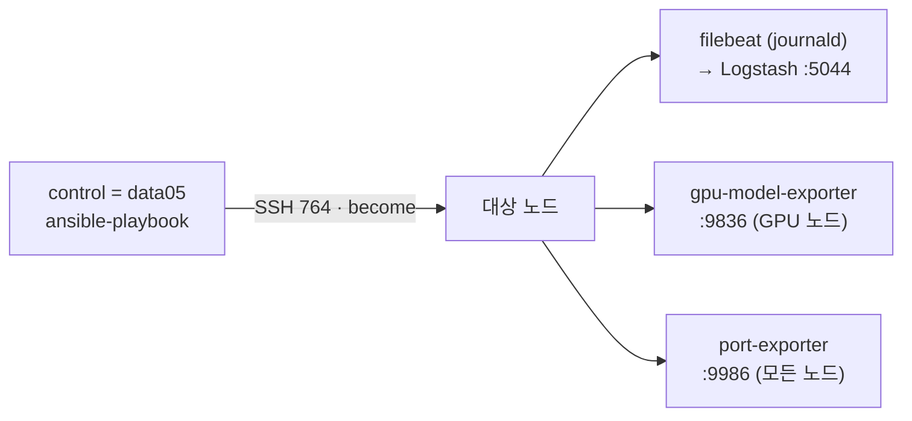

# infra/ansible · 노드 에이전트 배포 (Ansible)

> 플릿 각 노드에 **수집 에이전트를 멱등 배포**합니다 — 로그(Filebeat) + GPU 모델 익스포터 + 포트 익스포터. agentless SSH 푸시(control = `data05`), role-per-agent([ADR-0009](../../docs/decisions/0009-ansible-config-mgmt.md)·[ADR-0017](../../docs/decisions/0017-node-onboarding-standard.md)).

> [!IMPORTANT]
> 권위는 [`Constitution.md`](../../Constitution.md), 단일 기준은 [`docs/inventory.yaml`](../../docs/inventory.yaml). 에이전트는 role/playbook을 **생성만**, 라이브 **적용(playbook 실행)은 사람**(§11). 시크릿 없음(§13) — 키·비번은 레포 밖. 노드 추가/삭제 전체 절차는 [`docs/runbooks/node-onboarding.md`](../../docs/runbooks/node-onboarding.md).

## 무엇을 배포하나



| 역할 | playbook | 대상 그룹 | 산출 |
| --- | --- | --- | --- |
| **filebeat** | `playbooks/logging.yml` | `[logging]` | journald → data05 Logstash:5044 (M2 로그) |
| **gpu-model-exporter** | `playbooks/agents.yml` | `[gpu]` | 모델↔GPU↔포트 익스포터 systemd(:9836) |
| **port-exporter** | `playbooks/agents.yml` | `[nodes]` | 리스닝 포트↔프로세스 익스포터 systemd(:9986, 서비스맵 v2) |

> Logstash/OpenSearch/Grafana는 이 디렉터리 밖 — [`infra/logging`](../logging/README.md)·[`infra/monitoring`](../monitoring/README.md).

## 구성

| 경로 | 내용 |
| --- | --- |
| `ansible.cfg` | 실행 기본값 — inventory·roles 경로·`become=sudo`·SSH(`ansible_port` via inventory) |
| `inventory.ini` | 대상: `[logging]`·`[gpu]`·`[nodes]` = **data03**(mooner92, 직접)·**data04**(mhchoi, 터널)·**data05**(local) · `ansible_port=764` · `fleet_node` |
| `playbooks/logging.yml` | `filebeat` 역할 |
| `playbooks/agents.yml` | `gpu-model-exporter`(GPU 노드) + `port-exporter`(모든 노드) 역할 |
| `roles/filebeat/` | Elastic APT 설치 + `filebeat.yml.j2`(fleet_node·logstash 변수화) + enable |
| `roles/gpu-model-exporter/` | vendored 익스포터 배포 + systemd 유닛(포트·경로 파라미터화) + enable |
| `roles/port-exporter/` | 리스닝 포트↔프로세스 익스포터(:9986) systemd 유닛 + enable |

## 전제 (사람이 준비)

1. **control = data05**(관제 스택 호스트)에서 실행. data05 자신은 `ansible_connection=local`.
2. **대상 SSH(포트 764) 키 인증** — data05 공개키를 대상 계정에 등록:
   ```bash
   ssh-copy-id -p 764 mooner92@192.168.1.103   # data03 (1회)
   ssh-copy-id -p 764 mhchoi@192.168.1.104     # data04 (1회)
   ssh -p 764 mhchoi@192.168.1.104 true        # 무프롬프트 확인
   ```
   계정명은 노드마다 다르다(data03 `mooner92` / data04 `mhchoi`) — 가정하지 말고 대상 노드에서 `ls /home`으로 먼저 확인.
3. **sudo** — `ansible.cfg`는 `become_ask_pass=False`(NOPASSWD sudo 전제). **전 노드에 `/etc/sudoers.d/90-keiwi-ansible` 적용됨(2026-07-03 표준)** → `-K` 불필요.
   > [!NOTE] 신규 노드 NOPASSWD 등록
   > 온보딩 시 반드시 **원격에서** 1회 실행(원라이너 표준은 [`docs/runbooks/node-onboarding.md`](../../docs/runbooks/node-onboarding.md) 부록). 아직 미적용인 노드만 임시로 `-K`(`--ask-become-pass`) — 비번은 입력만(레포 저장 안 함 §13).
4. **Ansible 설치**(data05): `sudo apt install -y ansible`. `ansible.builtin`만 사용(community 모듈 불필요).
5. **로그용 ufw**(filebeat 대상 → data05:5044):
   ```bash
   sudo ufw allow from 192.168.1.0/24 to any port 5044 proto tcp
   ```

## 실행 (data05에서 — §11)

```bash
cd infra/ansible
ansible -i inventory.ini all -m ping                                   # 연결 확인

# 로그 수집기(Filebeat)
ansible-playbook -i inventory.ini playbooks/logging.yml --check --diff  # 드라이런
ansible-playbook -i inventory.ini playbooks/logging.yml [--limit data03]

# GPU 모델 + 포트 익스포터 (NOPASSWD 전 노드 표준 — -K 불필요)
ansible-playbook -i inventory.ini playbooks/agents.yml --check --diff
ansible-playbook -i inventory.ini playbooks/agents.yml [--limit data03]
```

> [!NOTE]
> 멱등 — 변경 없으면 `changed=0`, 설정이 바뀐 경우에만 서비스 재시작. `--check`는 시뮬레이션이라 일부 후속 태스크(systemd 기동 등)가 "유닛 없음"으로 보일 수 있음 → 실제 적용에서만 기동. 신규 노드 드라이런에서 filebeat 설치가 `No package matching`으로 실패하는 것도 check 모드 한계(Elastic APT repo가 아직 미등록) — 실제 실행은 정상(2026-07-03 data03 실측).

## 검증

```bash
# Filebeat 상태 + ES 노드별 로그
ansible -i inventory.ini logging -b -m shell -a 'systemctl is-active filebeat'
curl -s 'http://localhost:9200/keiwi-logs-*/_search?size=0' -H 'Content-Type: application/json' \
  -d '{"aggs":{"by_node":{"terms":{"field":"fleet_node"}}}}' | python3 -m json.tool   # data03·04·05 버킷

# GPU 모델 익스포터 (계정은 노드별 — data03 mooner92 / data04 mhchoi)
ssh -p 764 mooner92@192.168.1.103 'systemctl is-active keiwi-gpu-model-exporter && curl -s localhost:9836/metrics | grep -m3 gpu_model_info'
```

## 선택 파일 로그 (예: vLLM)

journald 외 파일 로그는 host_vars 또는 `-e`로:
```bash
ansible-playbook -i inventory.ini playbooks/logging.yml --limit data05 \
  -e '{"filebeat_extra_log_paths":["/var/log/vllm/*.log"]}'
```

## 노드 추가/삭제

`inventory.ini`의 `[logging]`/`[gpu]`/`[nodes]`에 노드 추가(또는 제거) + `fleet_node` 지정 → 재실행. 메트릭(터널·Prometheus)·오프보딩까지 전체 절차는 [`docs/runbooks/node-onboarding.md`](../../docs/runbooks/node-onboarding.md).

> [!CAUTION] 주의
> - **라이브 직접수정 금지(§12)** — 이 트리는 권장본, 적용은 위 절차로 사람이.
> - `filebeat.yml`·systemd 유닛은 **Ansible이 관리** — 노드에서 직접 고치면 다음 실행에 덮어써짐. 변경은 role 템플릿에서.
> - 내부망 + Cloudflare Access 뒤라 Filebeat→Logstash는 평문(계약 일치, §13).
> - 백로그(ADR-0017): node-exporter·dcgm-exporter도 role화, `docs/inventory.yaml`↔`inventory.ini` 동적 동기화, data02(Windows) winlogbeat.
