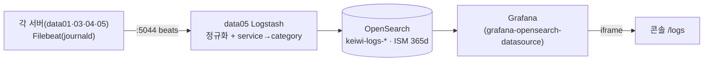

# infra/logging · 통합 로그 (M2) 운영

> KEIwi 플릿의 **로그 평면** — 각 서버 Filebeat(journald)가 data05 Logstash로 보내면, 정규화·분류해 OpenSearch에 적재하고 Grafana(콘솔 임베드)로 봅니다.

> [!IMPORTANT]
> 에이전트는 생성, **적용은 사람**(§11). 라이브 직접수정 금지(§12). 시크릿 레포 밖(§13).
> 근거: [ADR-0008](../../docs/decisions/0008-log-pipeline.md)(파이프라인) · [ADR-0010](../../docs/decisions/0010-log-taxonomy.md)(분류·보존) · [ADR-0011](../../docs/decisions/0011-signal-first-log-ux.md)(신호 우선 UX).

## 파이프라인



| 항목 | 값 |
| --- | --- |
| 수집 대상 | **data01·03·04·05**(Filebeat journald). data03·04·05는 role(apt 8.x); **data01은 xenial이라 7.17 벤더링**([`filebeat-xenial/`](filebeat-xenial/README.md), 2026-07-24 온보딩). 수신은 data05 ufw가 `192.0.2.0/24 → 5044` 허용(서브넷 전체라 노드 추가 시 규칙 변경 불필요). data02(Windows — winlogbeat 백로그 B02)는 제외 |
| 저장 | **OpenSearch**(ES 7.10 호환, Apache-2.0) — `docker-compose.yml` 컨테이너 `keiwi-opensearch`·`keiwi-logstash` |
| 데이터소스 | Grafana **`grafana-opensearch-datasource`**(내장 ES 플러그인 v13 파손으로 전환, uid `keiwi-logs-es`) |
| 표준 필드(계약) | `@timestamp · fleet_node · log_level · service · message · host_name` + `category · log_level_source`(ADR-0010) |
| 보존 | ISM **365일 후 delete**, 신규 `keiwi-logs-*`에 자동 부착 |
| 대시보드 | `infra/monitoring/dashboards/logs.json`(uid `keiwi-logs`, 신호 우선) |

> [!NOTE] Grafana provisioning은 바인드 마운트 (표준, 2026-07-02~)
> 데이터소스·대시보드는 호스트 `/data/monitoring/grafana/provisioning`을 컨테이너에 바인드해 프로비저닝합니다. `docker cp` 주입은 컨테이너 재생성 시 소실되므로 **금지**(소실 사고 실측) — 절차는 [`infra/monitoring`](../monitoring/README.md).

---

## 1. 서비스 분류 (category) — ADR-0010

`category`는 `service`(=systemd.unit)를 운영 범주로 묶는 **상호배타 6값**: `gpu · web · infra · system · user-session · unknown`. Logstash `translate` + 외부 regex 사전으로 파생.

### 1.1 신규 서비스 추가 (코드 수정 불필요)
`logstash/pipeline/service-category.yml`에 **anchored 상호배타 regex** 키만 추가(겹치면 비결정적 — 반드시 anchoring):
```yaml
"^myapp-.*": "web"
"^jupyter-.*": "notebook"
```
적용: 사전 파일은 이미 compose 볼륨 마운트(`./logstash/pipeline:ro`) → Logstash가 `refresh_interval`(300s)로 자동 리로드.

> [!NOTE]
> `logs.conf` §3b의 `translate-category` 블록은 **이미 repo에 반영됨**(적용만). `pipeline.yml`의 `path.config`가 `logs.conf` 단일이라 `.yml` 사전은 파이프라인으로 오로딩되지 않음(안전). §6 정리 블록이 `category`를 지우지 않게 둘 것.

### 1.2 통합 적용 절차 (data05, 사람 — 순서 중요)
`category`·`log_level_source`는 신설 keyword. `manage_template=false`라 **템플릿 선적용**을 안 하면 동적매핑이 text로 만들어 Grafana terms·변수가 깨진다. **반드시 ① 템플릿 → ② 파이프라인** 순.

```bash
cd /KEIwi/infra/logging

# ① 인덱스 템플릿 선적용 (category·log_level_source keyword)
curl -s -X PUT 'http://localhost:9200/_index_template/keiwi-logs' \
  -H 'Content-Type: application/json' -d @elasticsearch/keiwi-logs-template.json   # {"acknowledged":true}

# ①b 오늘 인덱스(이미 생성됨)는 템플릿 소급 안 됨 → category 문서 들어오기 전에 매핑 선반영
curl -s -X PUT "http://localhost:9200/keiwi-logs-$(date +%Y.%m.%d)/_mapping" \
  -H 'Content-Type: application/json' \
  -d '{"properties":{"category":{"type":"keyword"},"log_level_source":{"type":"keyword"}}}'

# ② 파이프라인 구성검증(:ro 마운트 + config.reload.automatic → git pull 즉시 라이브)
docker exec keiwi-logstash bin/logstash --path.settings /usr/share/logstash/config \
  -t -f /usr/share/logstash/pipeline/logs.conf      # "Config Validation Result: OK"
```

> [!WARNING] 레이스 주의 (중요)
> `:ro` 마운트 + `config.reload.automatic` 때문에 `git pull` 즉시 새 파이프라인이 돌아 **그날 인덱스에 category가 text로 동적매핑**됩니다(템플릿 PUT보다 먼저). 피하려면 **logstash를 멈추고** 받으세요:
> ```bash
> docker stop keiwi-logstash && git pull
> curl -X PUT .../_index_template/keiwi-logs -d @elasticsearch/keiwi-logs-template.json
> curl -X PUT ".../keiwi-logs-$(date +%Y.%m.%d)/_mapping" -d '{"properties":{"category":{"type":"keyword"},"log_level_source":{"type":"keyword"}}}'
> docker start keiwi-logstash
> ```
> translate 플러그인 부재로 검증 실패 시: `docker exec keiwi-logstash bin/logstash-plugin install logstash-filter-translate`.

### 1.3 이미 text로 매핑된 그날 인덱스 고치기 (reindex, 무손실)
```bash
D=$(date +%Y.%m.%d)
curl -s -X POST "localhost:9200/_reindex?wait_for_completion=true" -H 'Content-Type: application/json' \
  -d "{\"source\":{\"index\":\"keiwi-logs-$D\"},\"dest\":{\"index\":\"keiwi-logs-$D-fix\"}}"
curl -s -X DELETE "localhost:9200/keiwi-logs-$D"          # logstash가 다음 쓰기에 템플릿(keyword)으로 재생성
curl -s -X POST "localhost:9200/_reindex?wait_for_completion=true" -H 'Content-Type: application/json' \
  -d "{\"source\":{\"index\":\"keiwi-logs-$D-fix\"},\"dest\":{\"index\":\"keiwi-logs-$D\"}}"
curl -s -X DELETE "localhost:9200/keiwi-logs-$D-fix"
```
> 원본은 각 서버 journald에도 있어 최악에도 안전. **그날만의 문제** — 다음 일자 인덱스는 템플릿으로 처음부터 keyword.

### 1.4 검증
```bash
curl -s 'localhost:9200/keiwi-logs-*/_search?size=0' -H 'Content-Type: application/json' \
  -d '{"aggs":{"c":{"terms":{"field":"category","size":10}}}}'   # 분포가 유닛대로 갈리는지
```

---

## 2. log_level 교정 — "계측 먼저" (ADR-0010)

**실측:** `error`의 상당수는 **진짜 vLLM/torch ERROR**(앱 verbosity) — stderr→PRIORITY 인플레가 아님.

- **하지 말 것:** 모든 priority=3을 무작정 warn으로 내리기(진짜 에러 은폐).
- **구현됨(repo `logs.conf`):** grok bare-token에 `INFO|INFORMATION|NOTICE` 추가(vLLM bare `INFO` 줄이 본문 기준 info로 분류) + `log_level_source`(body|priority|default) **계측기** 신설.
  ```bash
  # stderr→priority 인플레 규모 정량화
  curl -s 'localhost:9200/keiwi-logs-*/_search?size=0' -H 'Content-Type: application/json' \
    -d '{"query":{"bool":{"must":[{"term":{"log_level":"error"}},{"term":{"log_level_source":"priority"}}]}}}'
  ```
- **보류(계측 후 결정):** `log_level_source:priority`가 크면 그때 PRIORITY=3→warn 다운그레이드. body 출처 error는 유지.

---

## 3. 보존 (OpenSearch ISM)

`elasticsearch/keiwi-logs-ism.json` — **365일 후 delete**(디스크 여유), 신규 `keiwi-logs-*`에 자동 부착.
```bash
curl -s -X PUT 'http://localhost:9200/_plugins/_ism/policies/keiwi-logs-retention' \
  -H 'Content-Type: application/json' -d @elasticsearch/keiwi-logs-ism.json
curl -s 'localhost:9200/_plugins/_ism/explain/keiwi-logs-*?pretty'      # 부착 확인
```
> [!CAUTION]
> `min_index_age`는 인덱스 **생성시각** 기준 — `seek:head` 백필 시 과거명 인덱스가 잔존(명-보존 불일치). 백필 지양, 불가피하면 직후 cursor 복귀 + 과거명 인덱스 수동삭제. 디스크는 vLLM 문서가 지배 → 단기 보존 필요 시 `gpu`만 별도 인덱스 라우팅 검토.

---

## 4. 대화형 워크로드(jupyter/OpenFOAM) — 유닛화 (ADR-0010)

셸에서 띄운 대화형 작업은 journald에 안 들어오거나 `user@<UID>.service`에 묻혀 분류 불가 → **유닛으로 띄워야** 분류된다.
- 권장: `systemd-run --user --unit=jupyter-$USER --collect jupyter lab ...` 또는 `jupyter@.service` 템플릿 + 래퍼. 고유 `_SYSTEMD_UNIT` 생성 → §1.1 사전에 키만 추가.

---

## 5. 신호 우선 대시보드 — ADR-0011

`infra/monitoring/dashboards/logs.json`(uid `keiwi-logs`). 첫 화면이 raw firehose가 안 되게 "문제 먼저".
- **레벨 변수 기본값 = `error,warn`** — info 홍수 자동 제외(드롭다운에서 All/info 추가 가능).
- 레이아웃: ① 에러 우선 stat(노이즈 제외) ② 로그 추세 + 상위 서비스 ③ 로그(메인, `dedupStrategy:signature`) ④ 전체 로그(접힌 행, 진단용).
- 변수: `node`(fleet_node) · `category` · `level`.
- 적용: `sudo cp infra/monitoring/dashboards/logs.json /data/monitoring/grafana/provisioning/dashboards/keiwi/` — 바인드 마운트라 30초 내 자동 반영(재시작 불필요, [infra/monitoring](../monitoring/README.md) 프로비저닝 표준).

---

## 6. 노이즈 정책 — ADR-0011

신호 패널 쿼리에 `AND NOT service:"rsyslog.service" AND NOT message:"UFW BLOCK"`로 제외.
> [!TIP]
> - **제외는 `service`(keyword) 기준으로.** `message`는 분석된 text라 토큰 의존(실측 `match_phrase omfile`=0). 메시지 기반 제외는 `GET /_analyze`로 토큰 확인 후에만.
> - 새 노이즈 서비스가 신호를 덮으면 `logs.json` 신호 패널 쿼리에 `AND NOT service:"<svc>"` 추가 → 재import. (whack-a-mole 임계 넘으면 ADR로 `log_class` 분류 전환.)
> - **근본은 발생원 차단** — 호스트 오작동이면 [런북](../../docs/runbooks/rsyslog-omfile-flood.md).

---

## 7. 트러블슈팅

| 증상 | 원인·조치 |
| --- | --- |
| rsyslog `omfile suspended` 도배 | 한 노드 error/warn 폭주 → [런북](../../docs/runbooks/rsyslog-omfile-flood.md)(진단·disable·정리) |
| /logs "Datasource not found" | 내장 ES 플러그인 v13 파손 → `grafana-opensearch-datasource` 확인(`docker exec grafana ls /var/lib/grafana/plugins/`) |
| 패널 "invalid query, missing metrics and aggregations" | OpenSearch ds는 빈 `bucketAggs` 거부 → `date_histogram` 버킷 + stat `reduce=sum` |
| category terms 집계 실패(text) | 그날 인덱스가 템플릿 PUT보다 먼저 받음 → §1.3 reindex |
| compose v1.29.2 `ContainerConfig` KeyError | recreate 버그 → `docker ps -aq --filter name=<svc>` \| `xargs -r docker rm -f` 후 `up -d` |
| 인덱스 템플릿 PUT 400 | OpenSearch는 `_comment` 등 루트 필드 거부 — 표준 키만 |

## 노드 추가/삭제
로그 대상 추가는 [`infra/ansible`](../ansible/README.md)(filebeat role) + 전체 절차 [`docs/runbooks/node-onboarding.md`](../../docs/runbooks/node-onboarding.md).
**구형 우분투(≤16.04 xenial)**는 8.x apt가 불가하므로 role 대신 [`filebeat-xenial/`](filebeat-xenial/README.md)(7.17 벤더링) 절차를 따른다.
