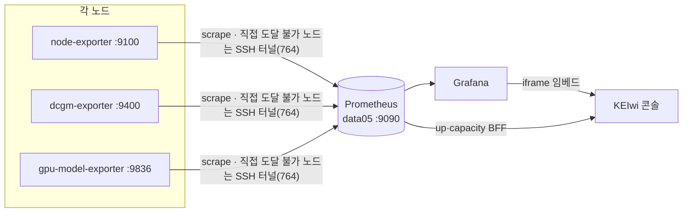

# infra/monitoring · 메트릭 수집 (Prometheus · Grafana)

> KEIwi 플릿의 **메트릭 평면** — 각 노드의 exporter를 Prometheus가 수집하고, Grafana 대시보드(콘솔 임베드)로 보여줍니다. 콘솔은 Prometheus `up`을 [`docs/inventory.yaml`](../../docs/inventory.yaml)와 매칭해 노드 상태(up/down/no-data)를 냅니다.

> [!IMPORTANT]
> 콘솔이 노드를 `up`/`down`으로 인식하려면 **Prometheus `up{instance}` 라벨이 inventory의 `exporters` 값(`ip:port`)과 정확히 일치**해야 합니다. 불일치 = 조용히 `no-data`.
> 권위는 [`Constitution.md`](../../Constitution.md). 에이전트는 설정을 **생성만**, 라이브(`.105`/`/data/monitoring`) **적용은 사람**(§11). 노드 추가/삭제의 단일 절차는 [`docs/runbooks/node-onboarding.md`](../../docs/runbooks/node-onboarding.md).

## 파이프라인에서의 위치



## 수집 현황 (노드 × exporter)

| 노드 | node :9100 | dcgm :9400 | gpu-model :9836 | 비고 |
| --- | :---: | :---: | :---: | --- |
| **data05** | ✅ 컨테이너 | ✅ A40×2 | ✅ | control · 스택 호스트 |
| **data04** | ✅ apt | ✅ RTX 6000×2 | ✅(Ansible role) | SSH 터널(764) 경유 |
| data01·03 | ⬜ | — | — | 터널 미설정 → `no-data`(설계) |
| data02 | ⬜ windows:9182 | — | — | 미배선(백로그) |

> [!NOTE]
> 라이브 Prometheus/Grafana/node-exporter/dcgm **스택 자체는 `/data/monitoring`(레포 밖)**에 있습니다. 이 디렉터리는 **권장본** — `prometheus.yml`·터널 유닛·대시보드·gpu-model-exporter를 버전관리하고, 사람이 라이브에 정렬합니다.

## 구성

| 경로 | 내용 |
| --- | --- |
| [`prometheus.yml`](./prometheus.yml) | scrape 잡(node·dcgm·gpu-model·vllm) — `instance`/`node` 라벨을 inventory와 일치 |
| [`keiwi-tunnel-data04.service`](./keiwi-tunnel-data04.service) | data04 exporter(:9100/9400/9836)를 .105 도커 브리지로 노출하는 SSH 터널 |
| [`gpu-model-exporter/`](./gpu-model-exporter) | 모델↔GPU↔포트 익스포터(소스+systemd) — 배포는 Ansible role([ADR-0017](../../docs/decisions/0017-node-onboarding-standard.md)) |
| [`grafana/provisioning/`](./grafana/provisioning) | Grafana 데이터소스·대시보드 provider(docker cp 주입) |
| [`dashboards/`](./dashboards) | `model-workload.json`(모델 워크로드, node 변수) 등 |

## 적용 순서 (.105에서, 사람 — §11)

> [!WARNING] 전제
> data04 sshd는 **포트 764**. .105의 `mooner92` 공개키가 data04 `mhchoi`에 등록돼야 합니다(`ssh-copy-id -p 764 mhchoi@192.168.1.104`). ufw active면 도커 브리지(`172.18.0.0/16`)가 터널/vLLM 포트에 닿게 **포트별로** 열어야 합니다(안 열면 타깃 down/timeout).

**① data04 SSH 터널** (node :9100 · dcgm :9400 · gpu-model :9836 포워드)
```bash
sudo cp infra/monitoring/keiwi-tunnel-data04.service /etc/systemd/system/
sudo systemctl daemon-reload && sudo systemctl enable --now keiwi-tunnel-data04
systemctl status keiwi-tunnel-data04        # active 확인
sudo ufw allow from 172.18.0.0/16 to any port 9104 proto tcp   # node
sudo ufw allow from 172.18.0.0/16 to any port 9404 proto tcp   # dcgm
sudo ufw allow from 172.18.0.0/16 to any port 9837 proto tcp   # gpu-model(data04)
```

**② Prometheus 설정 반영**
```bash
# prometheus.yml 내용을 /data/monitoring/prometheus.yml 에 정렬 후:
sudo docker restart prometheus      # compose 1.29 ContainerConfig 버그 → restart 권장
```

**③ data04 node-exporter** (data04에서 — docker 없으니 apt)
```bash
sudo apt update && sudo apt install -y prometheus-node-exporter
sudo systemctl enable --now prometheus-node-exporter   # :9100
```

> [!NOTE] GPU 모델 익스포터(:9836)는 수동이 아니라 **Ansible role**
> ```bash
> cd infra/ansible
> ansible-playbook -i inventory.ini playbooks/agents.yml --limit data04 -K
> ```
> 상세·터널·대시보드 node 변수까지 = [`docs/runbooks/node-onboarding.md` §3](../../docs/runbooks/node-onboarding.md). ([infra/ansible](../ansible/README.md))

## 모델 워크로드 대시보드 (`dashboards/model-workload.json`)

vLLM `/metrics`(요청·토큰·지연·KV캐시) + DCGM + `gpu_model_*`(모델↔GPU). **node 템플릿 변수**로 노드 구분(data04/data05).

> [!WARNING] vLLM 타깃 ufw
> Prometheus 컨테이너(브리지)가 호스트 vLLM 포트에 닿아야 합니다:
> ```bash
> sudo ufw allow from 172.18.0.0/16 to any port 8003 proto tcp   # vLLM
> sudo ufw allow from 172.18.0.0/16 to any port 8010 proto tcp
> ```

**프로비저닝**(라이브 Grafana는 디렉터리 미바인드 → docker cp):
```bash
sudo docker cp infra/monitoring/dashboards/model-workload.json \
    grafana:/etc/grafana/provisioning/dashboards/keiwi/model-workload.json
sudo docker restart grafana
```
콘솔 탭은 `apps/console/.env.local`의 `GRAFANA_DASHBOARD_UID`에 `keiwi-model-workload/...|모델`로 등록(콘솔 화면표는 [README](../../README.md#콘솔-화면)).

## 검증

```bash
# up 타깃(노드별)
curl -s 'http://localhost:9090/api/v1/query?query=up' | grep -o '192.168.1.10[45]:[0-9]*'
#   기대: 192.168.1.104:9100/9400, 192.168.1.105:9100/9400
# 모델↔GPU (node 라벨)
curl -s localhost:9090/api/v1/query --data-urlencode 'query=gpu_model_info{node="data04"}'
```
콘솔 Overview에서 **data04·data05 = 정상**, **data01~03 = 데이터 없음**, 노드 클릭 → **서비스·시스템·GPU·모델** 드릴다운.

## 노드 추가/삭제

단일 표준 절차 → [`docs/runbooks/node-onboarding.md`](../../docs/runbooks/node-onboarding.md)(메트릭·로그 두 평면 · 터널 복제 · Prometheus 타깃 · 오프보딩). inventory는 이미 5노드라 6번째부터 `docs/inventory.yaml` 수정.

> [!CAUTION] 보안(§13)
> 라이브 compose의 Grafana 관리자 비밀번호가 평문 기본값이면 env/시크릿으로 옮기세요. 콘솔은 Grafana 토큰을 주입하지 않습니다(인증은 Cloudflare Access).
