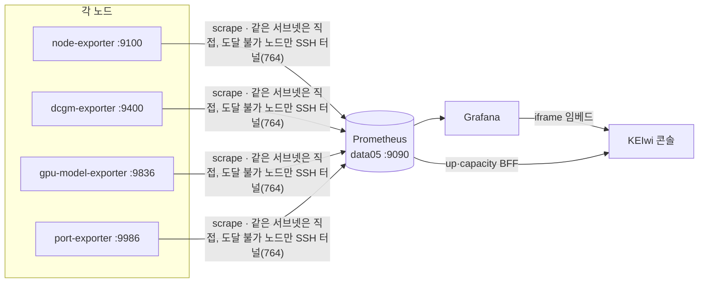

# infra/monitoring · 메트릭 수집 (Prometheus · Grafana)

> KEIwi 플릿의 **메트릭 평면** — 각 노드의 exporter를 Prometheus가 수집하고, Grafana 대시보드(콘솔 임베드)로 보여줍니다. 콘솔은 Prometheus `up`을 [`docs/inventory.yaml`](../../docs/inventory.yaml)와 매칭해 노드 상태(up/down/no-data)를 냅니다.

> [!IMPORTANT]
> 콘솔이 노드를 `up`/`down`으로 인식하려면 **Prometheus `up{instance}` 라벨이 inventory의 `exporters` 값(`ip:port`)과 정확히 일치**해야 합니다. 불일치 = 조용히 `no-data`.
> 권위는 [`Constitution.md`](../../Constitution.md). 에이전트는 설정을 **생성만**, 라이브(`.105`/`/data/monitoring`) **적용은 사람**(§11). 노드 추가/삭제의 단일 절차는 [`docs/runbooks/node-onboarding.md`](../../docs/runbooks/node-onboarding.md).

## 파이프라인에서의 위치



## 수집 현황 (노드 × exporter)

| 노드 | node :9100 | dcgm :9400 | gpu-model :9836 | port :9986 | 비고 |
| --- | :---: | :---: | :---: | :---: | --- |
| **data05** | ✅ 컨테이너 | ✅ A40×2 | ✅ | ✅ | control · 스택 호스트 |
| **data04** | ✅ apt | ✅ RTX 6000×2 | ✅(Ansible role) | ✅ | SSH 터널(764) 경유 |
| **data03** | ✅ | ✅ Quadro RTX 6000×2 | ✅(Ansible role) | ✅ | **직접 스크랩**(터널 불필요 — data03 ufw가 `.105 → 9100/9400/9836/9986` 허용) · 2026-07-03 온보딩 |
| data01 | ⬜ | — | — | — | 미접근 → `no-data`(설계) |
| data02 | ⬜ windows:9182 | — | — | — | 미배선(백로그 B02) |

GPU는 총 **6장**(data03 Quadro RTX 6000×2 · data04 RTX 6000×2 · data05 A40×2), 드라이버 플릿 표준 **535.309.01**.

> [!NOTE]
> 라이브 Prometheus/Grafana/node-exporter/dcgm **스택 자체는 `/data/monitoring`(레포 밖)**에 있습니다. 이 디렉터리는 **권장본** — `prometheus.yml`·터널 유닛·대시보드·gpu-model-exporter를 버전관리하고, 사람이 라이브에 정렬합니다.

## 구성

| 경로 | 내용 |
| --- | --- |
| [`prometheus.yml`](./prometheus.yml) | scrape 잡(node·dcgm·gpu-model·port·vllm) — `instance`/`node` 라벨을 inventory와 일치. **신규 노드의 `node` 라벨은 스크랩단에서 부여**(대시보드 `label_replace` IP 하드코딩은 104/105 레거시) |
| [`keiwi-tunnel-data04.service`](./keiwi-tunnel-data04.service) | data04 exporter(:9100/9400/9836/9986)를 .105 도커 브리지로 노출하는 SSH 터널 — 같은 서브넷에서 직접 도달되는 노드(data03)는 터널 불필요 |
| [`gpu-model-exporter/`](./gpu-model-exporter) | 모델↔GPU↔포트 익스포터(소스+systemd) — 배포는 Ansible role([ADR-0017](../../docs/decisions/0017-node-onboarding-standard.md)) |
| [`grafana/provisioning/`](./grafana/provisioning) | Grafana 데이터소스·대시보드 provider — 호스트 `/data/monitoring/grafana/provisioning`에 두고 **바인드 마운트**(아래 프로비저닝 표준, docker cp 금지) |
| [`dashboards/`](./dashboards) | `model-workload.json`(모델 워크로드, node 변수) 등 |

## 적용 순서 (.105에서, 사람 — §11)

> [!WARNING] 전제
> data04 sshd는 **포트 764**. .105의 `mooner92` 공개키가 data04 `mhchoi`에 등록돼야 합니다(`ssh-copy-id -p 764 mhchoi@192.168.1.104`). ufw active면 도커 브리지(`172.18.0.0/16`)가 터널/vLLM 포트에 닿게 **포트별로** 열어야 합니다(안 열면 타깃 down/timeout).

> [!NOTE] data03은 터널 없이 직접 스크랩 (2026-07-03)
> 같은 서브넷 노드는 **직접 스크랩이 우선**(터널은 도달 불가 시만). data03은 자기 ufw에서 `.105 → 9100/9400/9836/9986`만 허용하면 끝 — 아래 ①(터널)은 data04 전용이고, ②의 `prometheus.yml`에 data03 타깃(192.168.1.103)이 이미 반영돼 있습니다.

**① data04 SSH 터널** (node :9100 · dcgm :9400 · gpu-model :9836 · port :9986 포워드)
```bash
sudo cp infra/monitoring/keiwi-tunnel-data04.service /etc/systemd/system/
sudo systemctl daemon-reload && sudo systemctl enable --now keiwi-tunnel-data04
systemctl status keiwi-tunnel-data04        # active 확인
sudo ufw allow from 172.18.0.0/16 to any port 9104 proto tcp   # node
sudo ufw allow from 172.18.0.0/16 to any port 9404 proto tcp   # dcgm
sudo ufw allow from 172.18.0.0/16 to any port 9837 proto tcp   # gpu-model(data04)
sudo ufw allow from 172.18.0.0/16 to any port 9987 proto tcp   # port-exporter(data04)
```

**② Prometheus 설정 반영**
```bash
# prometheus.yml 내용을 /data/monitoring/prometheus.yml 에 정렬 후:
sudo docker restart prometheus      # compose 1.29 ContainerConfig 버그 → restart 권장
```

**③ data04 node-exporter** (data04에서 — docker 없으니 apt)
```bash
sudo apt update && sudo apt install -y prometheus-node-exporter
sudo systemctl enable --now prometheus-node-exporter   # :9100
```

> [!NOTE] GPU 모델 익스포터(:9836)는 수동이 아니라 **Ansible role**
> ```bash
> cd infra/ansible
> ansible-playbook -i inventory.ini playbooks/agents.yml --limit data04
> ```
> NOPASSWD sudo가 전 노드 표준(`/etc/sudoers.d/90-keiwi-ansible`)이라 `-K` 불필요([infra/ansible](../ansible/README.md)).
> 상세·터널·대시보드 node 변수까지 = [`docs/runbooks/node-onboarding.md` §3](../../docs/runbooks/node-onboarding.md). ([infra/ansible](../ansible/README.md))

## 디자인 v3 대시보드 (`dashboards/*-v3.json`)

콘솔 디자인 v3(정적·Quiet Console)에 맞춘 **테마 변형**입니다. 콘솔 화면의 약 67%가 이 임베드라, 크롬만 바꾸면 "디자인이 그대로"로 보입니다 — 대시보드가 진짜 레버입니다.

| 원본 | v3 변형 | uid |
| --- | --- | --- |
| `system.json` | `system-v3.json` | `keiwi-system-v3` |
| `gpu.json` | `gpu-v3.json` | `keiwi-gpu-v3` |
| `model-workload.json` | `model-workload-v3.json` | `keiwi-model-workload-v3` |
| `logs.json` | `logs-v3.json` | `keiwi-logs-v3` |

**무엇이 다른가** — 쿼리·변수·데이터소스는 **원본과 동일**(시각 표현만 변경):
- **게이지(gauge) 전면 제거** → `stat` + 스파크라인. 알록달록한 아크가 화면을 낡아 보이게 하던 주범.
- **전 패널 `transparent: true`** → 패널 배경·테두리를 없애 콘솔 페이지에 녹아든다.
- **정상은 무채색**, 임계 초과 시에만 유채색(`#F79009`/`#D92D20`). 초록 임계 금지.
- 시리즈는 중립 계조 + 선 스타일(점선)로 구분 — 색으로 구분하지 않는다.

> [!NOTE] 원본과 공존한다 (prod 무손상)
> uid가 다르므로 **추가**될 뿐입니다. 어느 대시보드를 볼지는 콘솔이 env로 정하므로, 원본을 보는 콘솔과 v3를 보는 콘솔이 같은 Grafana를 공유하며 나란히 돌 수 있습니다.

```bash
# 적용(사람, §11)
sudo cp infra/monitoring/dashboards/{system,gpu,model-workload,logs}-v3.json \
    /data/monitoring/grafana/provisioning/dashboards/keiwi/
# 바인드 마운트라 30초 내 자동 반영(재시작 불필요). 확인:
curl -s 'http://localhost:3000/api/search?query=v3' | grep -o '"uid":"[^"]*"'
```

**콘솔을 v3로 전환** — `apps/console/.env.local`의 uid를 `-v3`로 바꾸고 재시작합니다(값은 `"경로|라벨"` 쉼표 목록, 슬러그까지 써야 kiosk가 유지됨):
```
GRAFANA_DASHBOARD_UID=keiwi-system-v3/keiwi-system-v3?...|시스템,keiwi-gpu-v3/gpu-v3?...|GPU,keiwi-model-workload-v3/keiwi-model-workload-v3?...|모델
GRAFANA_LOGS_DASHBOARD_UID=keiwi-logs-v3/<슬러그>|통합 로그
```
되돌리려면 `-v3`만 지우면 됩니다(대시보드 삭제 불필요).

## 모델 워크로드 대시보드 (`dashboards/model-workload.json`)

vLLM `/metrics`(요청·토큰·지연·KV캐시) + DCGM + `gpu_model_*`(모델↔GPU). **node 템플릿 변수**로 노드 구분(data04/data05).

> [!WARNING] vLLM 타깃 ufw
> Prometheus 컨테이너(브리지)가 호스트 vLLM 포트에 닿아야 합니다:
> ```bash
> sudo ufw allow from 172.18.0.0/16 to any port 8003 proto tcp   # vLLM
> sudo ufw allow from 172.18.0.0/16 to any port 8010 proto tcp
> ```

**프로비저닝 — 바인드 마운트(표준, 2026-07-02~)**:
> [!CAUTION] `docker cp` 주입 금지
> docker cp는 컨테이너 쓰기 레이어에 들어가 **재생성 시 소실**됩니다(2026-07-02 익명뷰어 적용 재생성 때 keiwi-gpu·model-workload·logs 대시보드 소실 사고). 호스트 디렉터리에 두고 바인드하세요(권장 compose에 포함).
```bash
# 레포(원본) → 호스트 프로비저닝 디렉터리
sudo mkdir -p /data/monitoring/grafana/provisioning/dashboards/keiwi \
              /data/monitoring/grafana/provisioning/datasources
sudo cp infra/monitoring/grafana/provisioning/dashboards/keiwi-dashboards.yaml \
    /data/monitoring/grafana/provisioning/dashboards/
sudo cp infra/monitoring/dashboards/{gpu,logs,model-workload}.json \
    /data/monitoring/grafana/provisioning/dashboards/keiwi/
sudo cp infra/monitoring/grafana/provisioning/datasources/opensearch.yaml \
    /data/monitoring/grafana/provisioning/datasources/     # elasticsearch.yaml은 넣지 않는다(폐기)
# compose의 grafana.volumes에 프로비저닝 바인드 2줄(권장본 docker-compose.yml 참고) 후 재생성
sudo docker rm -f grafana && sudo docker-compose up -d grafana
# 대시보드 JSON 갱신 시: 호스트 경로에 cp만 하면 30s 내 자동 반영(updateIntervalSeconds)
```
콘솔 탭은 `apps/console/.env.local`의 `GRAFANA_DASHBOARD_UID`에 `keiwi-model-workload/...|모델`로 등록(콘솔 화면표는 [README](../../README.md#콘솔-화면)).

## 검증

```bash
# up 타깃(노드별)
curl -s 'http://localhost:9090/api/v1/query?query=up' | grep -o '192.168.1.10[345]:[0-9]*'
#   기대: 192.168.1.103/104/105 각각 :9100/:9400 (+ gpu-model·port 타깃)
# 모델↔GPU (node 라벨)
curl -s localhost:9090/api/v1/query --data-urlencode 'query=gpu_model_info{node="data04"}'
```
콘솔 Overview에서 **data03·data04·data05 = 정상**, **data01~02 = 데이터 없음**, 노드 클릭 → **시스템·GPU·모델·서비스** 드릴다운.

## Grafana 익명 뷰어 (LAN 조회 전용, 2026-07-02)

내부(IP) 접속 임베드에서 Grafana 로그인 없이 대시보드를 보이게 하는 설정 — **조회(Viewer)만 익명**, 편집/관리자는 여전히 로그인. 외부(grafana.excusa.uk)는 Cloudflare Access가 앞단에서 차단하므로 익명이 외부에 노출되지 않습니다. 권장본: [`docker-compose.yml`](./docker-compose.yml).

**[server] 사람이 적용(§11)** — data05에서:
```bash
cd /data/monitoring
# ① docker-compose.yml의 grafana.environment에 2줄 추가:
#      - GF_AUTH_ANONYMOUS_ENABLED=true
#      - GF_AUTH_ANONYMOUS_ORG_ROLE=Viewer
# ② env 변경은 재시작이 아니라 "재생성"이 필요 (grafana_data 볼륨이라 대시보드/설정 안전):
sudo docker-compose up -d grafana
# compose 1.29 'ContainerConfig' 버그가 나면:
sudo docker-compose rm -sf grafana && sudo docker-compose up -d grafana
# ③ 확인 — 익명 조회 200:
curl -s -o /dev/null -w '%{http_code}\n' http://localhost:3000/api/dashboards/home   # 200이면 OK(익명)
```

> [!WARNING] 알려진 이슈 — 시스템 대시보드(uid `rYdddlPWk`) 익명 403
> 이 대시보드만 익명 뷰어에서 403(대시보드 개별 권한). Grafana UI에서 해당 대시보드 권한에 `Viewer: View` 추가가 필요 — 적용 대기(2026-07-03 기준).

## 노드 추가/삭제

단일 표준 절차 → [`docs/runbooks/node-onboarding.md`](../../docs/runbooks/node-onboarding.md)(메트릭·로그 두 평면 · 터널 복제 · Prometheus 타깃 · 오프보딩). inventory는 이미 5노드라 6번째부터 `docs/inventory.yaml` 수정.

> [!CAUTION] 보안(§13)
> 라이브 compose의 Grafana 관리자 비밀번호가 평문 기본값이면 env/시크릿으로 옮기세요. 콘솔은 Grafana 토큰을 주입하지 않습니다(인증은 Cloudflare Access).
> ※ `GF_SECURITY_ADMIN_PASSWORD`는 **볼륨 최초 초기화 때만** 적용 — 이후 UI에서 바꾼 실제 비밀번호와 다를 수 있음(2026-07-02 확인: compose 값 ≠ 현재 DB 비번). 재설정이 필요하면: `sudo docker exec grafana grafana cli admin reset-admin-password '<새비번>'`
